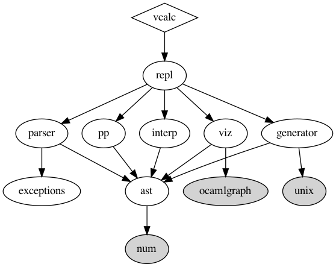

# Visual Calculator

[](https://github.com/hasantouma/vcalc/actions/workflows/workflow.yml)

## Example

```
((((3 * 8) + (4 / 2)) - 1) + 7) = 32
```


## `dune-deps` graph

[dune-deps GitHub source code](https://github.com/mjambon/dune-deps)



